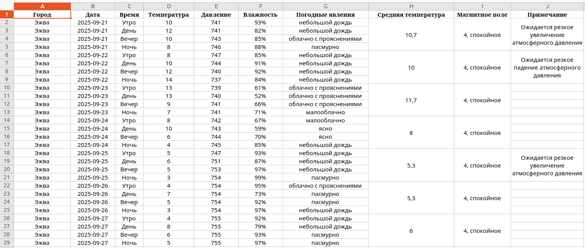

# Weather Forecast Excel Reporter


## Описание проекта

Программа получает прогноз погоды на 7 дней для указанного города с сайта Яндекс.Погода и формирует Excel-файл с прогнозом.  
Также ведется логирование запросов и результатов работы в SQLite (город, координаты, дата/время, успешность или ошибка).

---

## Установка и запуск

1. Склонировать проект и перейти в его папку:

```bash
git clone https://github.com/DmitriiViktorov/Yandex_weather.git
cd Yandex_weather
```

2. Создать виртуальное окружение и активировать его:

```bash
python -m venv .venv
# Linux / Mac
source .venv/bin/activate
# Windows
.venv\Scripts\activate
```

3. Установить зависимости:

```bash
pip install -r requirements.txt 
```

4. Создать в корне проекта `.env` файл:
   
   В проекте есть пример для заполнения - файл `.env.example`. Скопируйте его содержимое в `.env` и задайте свои значения переменным.

5. Применить миграции базы данных:

```bash
alembic upgrade head
```

6. Запустить FastAPI сервер:

```bash
python main.py
```

Сервер будет доступен по адресу http://127.0.0.1:8000. 

---

## Использование

1. Откройте http://127.0.0.1:8000 в браузере
2. Введите название города в поисковую форму
3. Выберите нужный вариант из предложенных
4. Нажмите "Скачать отчёт" для получения Excel-файла с прогнозом

---

## API Endpoints

- `GET /` - Главная страница
- `POST /api/search_city` - Поиск города по названию
- `POST /api/weather_data` - Получение Excel-отчета с прогнозом

---

## Технологии

- **FastAPI** - веб-фреймворк
- **SQLAlchemy** - ORM для работы с БД
- **Alembic** - миграции БД
- **BeautifulSoup4** - парсинг HTML
- **openpyxl** - создание Excel файлов
- **Pydantic** - валидация данных
- **aiosqlite** - асинхронная работа с SQLite

---

## Пример результата



*Пример сгенерированного Excel-файла с прогнозом погоды на 7 дней*

---

## Примечания

- Для корректной работы требуется подключение к интернету
- SQLite база создается автоматически при первом запуске
- Все запросы к API логируются в базу данных
- Поддерживается асинхронная обработка запросов